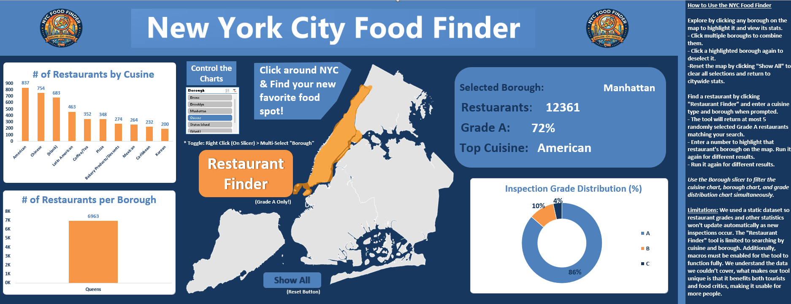
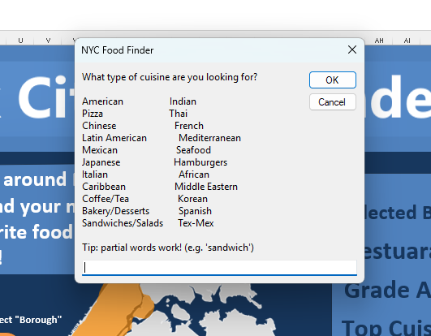
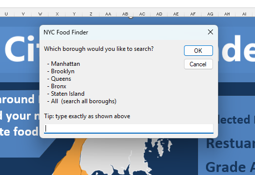
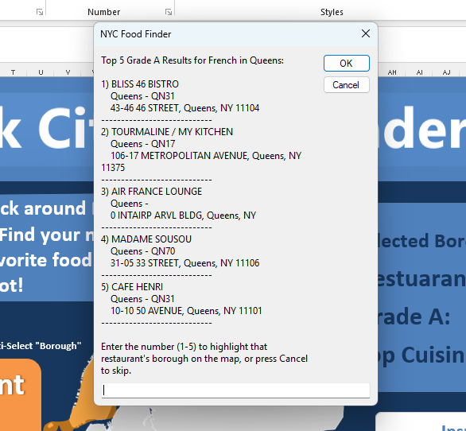

# NYC Restaurant Dynamic Dashboard

An interactive Excel dashboard for exploring New York City restaurant health inspection data, built with VBA macros and dynamic visualizations.

## Overview
This tool allows users to explore NYC to find restaurants and their inspection data across all five boroughs through an interactive map interface and a VBA-powered Restaurant Finder tool. Clicking boroughs on the map dynamically updates KPI stats including total restaurants, Grade A percentage, and top cuisine type.

## Features
- Interactive NYC borough map with clickable selection and multi-select support
- Dynamic KPI panel showing restaurant count, Grade A rate, and top cuisine per borough
- Cuisine breakdown bar chart and restaurant count by borough chart
- Inspection Grade Distribution pie chart (A/B/C breakdown)
- VBA-powered Restaurant Finder — filters by cuisine type and borough, returns top 5 Grade A results with addresses

## Tools Used
- Microsoft Excel (.xlsm)
- VBA (Visual Basic for Applications)
- Excel Slicers and PivotCharts

## Screenshots

### Dashboard Overview

### Restaurant Finder — Cuisine Selection

### Restaurant Finder — Borough Selection

### Restaurant Finder — Results

## Background
Built as a project for a Business Information Technology course at Virginia Tech's Pamplin College of Business (Spring 2026).
